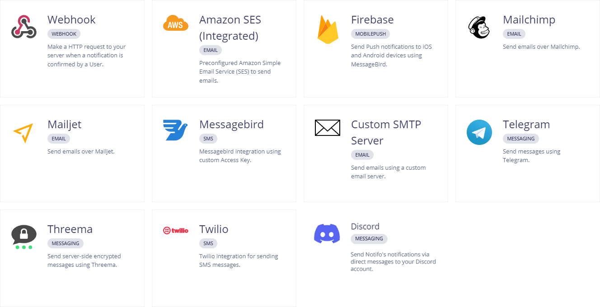

# Notifo - Notification Service

[](https://github.com/notifo-io/notifo/actions/workflows/deploy.yml) 
[](https://hub.docker.com/r/squidex/notifo)

Try it out at https://app.notifo.io!

Notifo is a multi-channel notification service for collaboration tools, e-commerce, news, magazines and everybody who wants to notify their users.


## Features

* Powerful and rich REST API with OpenAPI documentation.
* Management UI to create notification templates, users, subscription, projects, settings and email templates.
* Email templates with MJML and Liquid Templates.
* Rich notification with a lot of formatting options like small and large images.
* Abstraction over multiple channels and providers
    * Emails (currently Amazon SES)
    * Web (Sockets)
    * WebPush (custom built)
    * MobilePush (currently Google Firebase)
    * SMS (currently MessageBird)
* Reliable through retry mechanisms and message queues for all notifications and channels.
* Tracking which notification has been read or confirmed.
* Integrated plugin to add a notification overlay to your web application.

## Integrations



## How it works

* **Users** subscribe to topics that are defined by a path such as `clothes/shoes/nike`. It is your job to provide a good UI for that.
* **Backend** creates events using very specific topic paths, such as `clothes/shoes/nike/<model>`.
* **Notifo** creates user events based on the matching subscriptions. Subscriptions are either for specific paths or parent paths as in the example above and having individual notification preferences.
* **Queues** and schedulers are responsible to send notifications to users when the notification has not been confirmed yet.

This allows a wide range of scenarios:
* In a task management system you can automatically subscribe users to a project, e.g. `project/123` and use a notification preference to only send web notifiations or web push notifications. When a user manually subscribes to a specific task, e.g. `project/123/tasks/abc` you can create this subscription with a preference to send out emails as well.

* Notifications can have a confirmation preference (None, Explicit, Seen). Only unconfirmed notifications are sent through a channel and you can configure a delay when sending notifications. This means that a user does not receive a confirmation when he or she has already explicitly confirmed it (**Explicit** Mode) or has seen it (**Seen** mode). This avoids to spam your users which notifications he does not need anymore and you can also track who has seen or confirmed urgent and important notifications.

Have a look to the [presentation](media/notifo!.pdf) to understand how it works.

## How to run it

Before you install it, try it out at https://app.notifo.io

### Install it using the docker image

docker images are available: https://hub.docker.com/r/squidex/notifo, you can try the [docker-compose](dependencies/docker-compose.yml) file

### How to configure it

Have a look to the settings for all configuration options: [appSettings.json](backend/src/notifo/appSettings.json). Everything in the settings can be configured using environment variables.

The following setting

```json
"mongoDB": {
    "connectionString": "mongodb://localhost",
},
```

is mapped to the enviornment variable `MONGODB__CONNECTIONSTRING` (note the double underscore).

## Tech Stack

Notifo uses the following technologies.

### Server

* ASP.NET Core 6 for Multi-Platform Support
* SignalR for Sockets
* MongoDB (support for more Databases is planned)
* OpenID Connect

### Frontend

* React
* React Router
* Formik
* Redux
* Redux Toolkit
* Typescript
* Bootstrap with custom Sass and [Argon Design](https://www.creative-tim.com/product/argon-design-system) Theme.
* ...many more libraries.

## Where is it used?

It was originally developed for Squidex Headless CMS (https://squidex.io), it is also used in a few other commercial applications in a testing stage.

Currently it is still in Beta and some features such as Mobile Push and Emails are not used in production yet.

## How to contribute?

There is still a lot to do:

* Support for other databases (I would prefer https://github.com/sebastienros/yessql)
* Other Email providers.
* Other SMS providers.
* Test application for mobile push (iOS and Android)
* Hardening scheduling and message queues.
* More channels (e.g. WhatsApp or Voice).
* Testing and tests
* Automated API and UI tests and more tests in general.

## More Screenshots

User Management:


Event Templates:


Media Gallery:


Debug Log:


